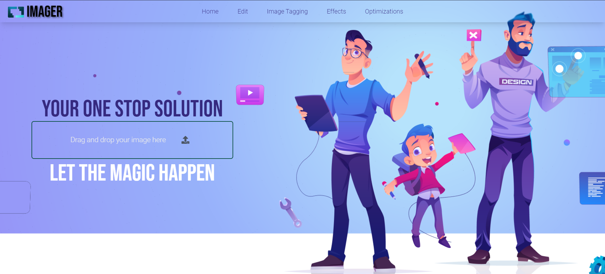
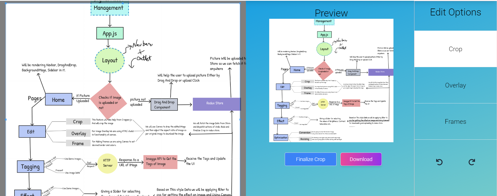
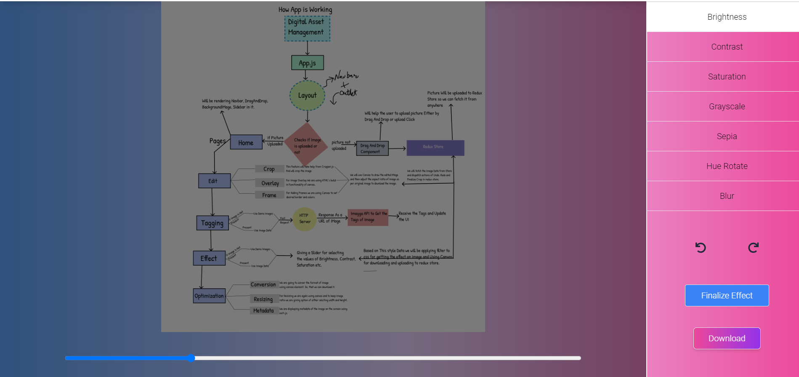

# Digital-Asset-Management

Digital Asset Management is a react-based web application which provides a one-stop solution to all the problems related to image handling. You can interact with the app here. <br>
👉 [Digital Asset Management](https://digital-asset-management.vercel.app/) 

## Table of Contents

- [Installation](#installation)
- [Usage](#usage)
- [Configuration](#configuration)
- [Workflow](#workflow)
- [Tests](#tests)
- [FAQ](#faqs)
- [Contact Information](#contact)


## Installation 
This Project is divided into two parts 1st is react and app and second is an HTTP server which works as a standalone Restful API. Directory named as httpServer contains code for express server and root directory contains code for Frontend Part.

To start with 

1. **Clone the repository:**
2. **Navigate to the project directory:**

To Run the HTTP server 
```
cd ./httpServer
yarn i
node Server.js
```


To get started with React Project 


3. **Install dependencies using npm in root directory**
4. **Run a local deployment**

   ```
   git clone https://github.com/mecskyverse/Digital-Asset-Management.git
   cd Digital-Asset-Management
   npm install
   npm run dev

Open port 5173 and 8081(server) on your localhost and you are good to go.<br>
For Demo purposes I have added .env in github files with the api key.

### Usage
* Upload an image through Drag And Drop or upload button.
* Image Editing features like Cropping, Framing, Text Overlay is supported.
* At any point of time we can finalize edits, download the image or use Undo and Redo features.
* Effects Page helps to add effects like Brightness, Contrast, Saturation etc. in the image.
* AI Powered Image Tagging helps us to get the Tags of our image.
* Optimization page can help the image with format conversion, metadata extraction or resizing the image.
* Home Page is fully responsive with a sidebar do check it out. 
* This app can support any type of image be it png, jpeg and webP.

### Configuration
There is no additional configuration needed for running this app. I am using `Node version 18.16.0` and `NPM version 9.5.1` while building this project.<br>
Currently, the only thing needed is api key for imagga(an AI based image tagging API) which I have shared in .env file. I know it should not be shared but this key is for demo purpose and you can use it.

### WorkFlow

Through the above chart you can get a fair idea of how the app is working. I have used Redux Toolkit for better state management than the prototype. 

#### Home Page
 We have to upload the image in this DragAndDrop. And then navigate to go on other section for example on edit section. 

Or an Effect Section just use the nav and app will automatically manage the state from every path.



### Tests
For Unit testing after deploying the project locally  
`npm run test`. It will use jest to perform Unit test.

### FAQs

#### What is My Project?

Its an digital asset management app which is currently being planned for managing images. All image related problem can have one stop solution. Format conversions, editing, padding, AI tagging. All of these can be done easily in browser itself. Although, I have started making this project for #TechSurf2023 but I am liking this project building no matter if I selected for next round or not I am going to complete this project.

#### I encountered an error during installation. What should I do?

Make sure you are using correct version of node and npm. For further assistance you can contact me.

#### Why have you added .env here?

I know that you should never leak your environment variables but for testing purposes for the judges to make it easy for them I open-sourced .env

### Contact
You can contact me through this platforms I am mostly active at this platforms.

[X](https://www.twitter.com/meckskyverse)<br>
[Instagram](https://www.instagram.com/mecskyverse)

or you can contact me through my portfolio

[Portfolio](https://aakashverma.vercel.app/).

